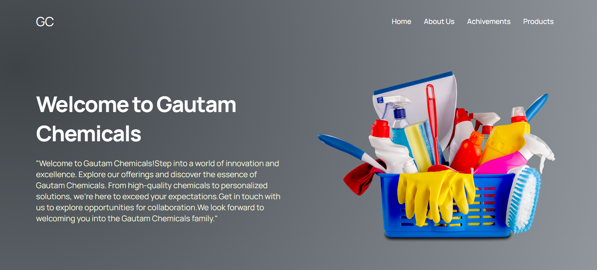
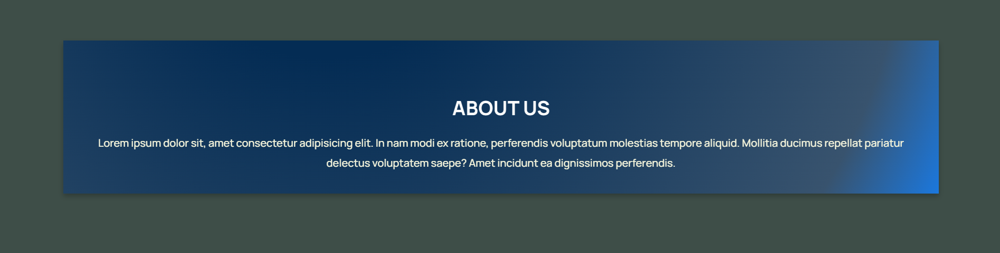
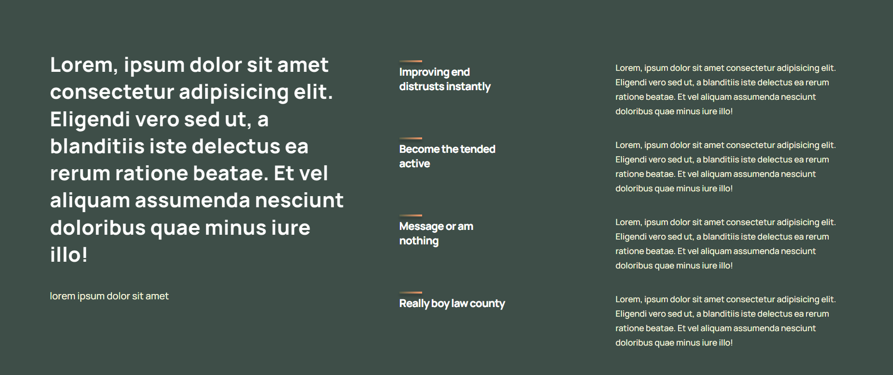
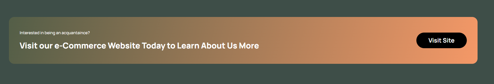
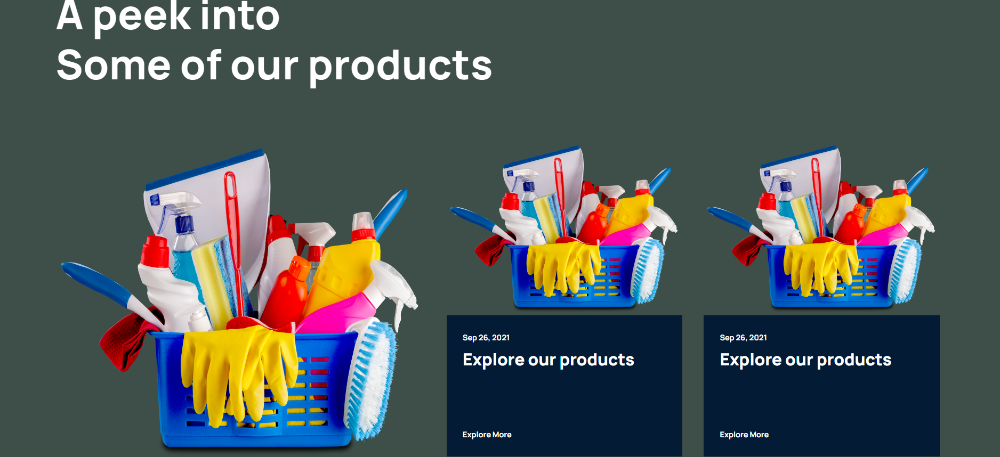
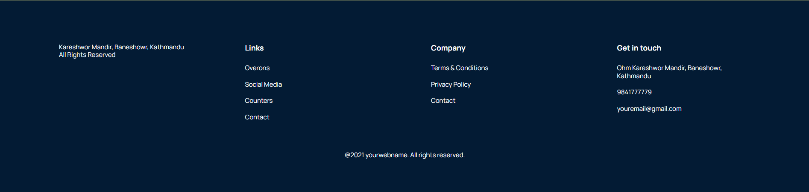

# Getting Started with Create React App

This project was bootstrapped with [Create React App](https://github.com/facebook/create-react-app).

## Available Scripts

In the project directory, you can run:

### `npm start`

Runs the app in the development mode.\
Open [http://localhost:3000](http://localhost:3000) to view it in your browser.

The page will reload when you make changes.\
You may also see any lint errors in the console.

### `npm test`

Launches the test runner in the interactive watch mode.\
See the section about [running tests](https://facebook.github.io/create-react-app/docs/running-tests) for more information.

### `npm run build`

Builds the app for production to the `build` folder.\
It correctly bundles React in production mode and optimizes the build for the best performance.

The build is minified and the filenames include the hashes.\
Your app is ready to be deployed!

This is the wark through of the website

This is the homepage or the landing page of the website here we have the Logo "GC" on hover changes into "Gautam Chemicals".
Similarly we have the navigation bar on the right side of the project
Then the header text which has the typewriter effect and the berief text which has a popup (needs to be added for now).

This is the about us page in which we will be brifely about Gautam Chemicals

Similarly this is the achievements page where we share about our achievements

This will lead us to our e-Commerece Website "Aroma Nepal"

Here we have the peek into some of our projects( this is just an illustration real images are yet to be kept after being sent)

This is the footer of the page